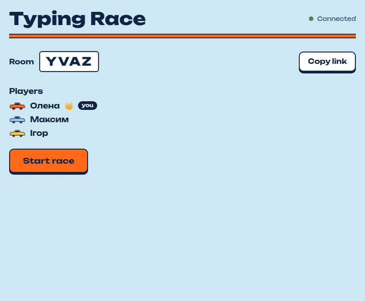
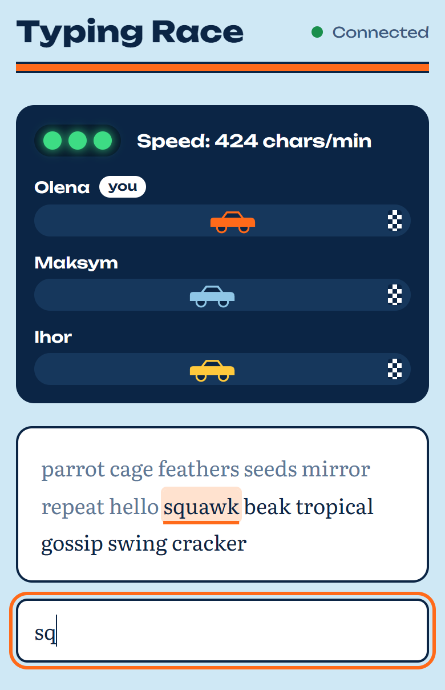
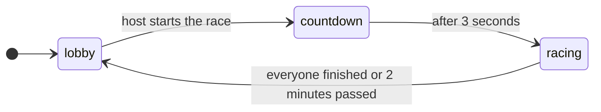

# Typing Race

Real-time typing races with friends, right in the browser. Create a room, send the link and find out who types the text fastest.

**Play:** https://typing-race-cqd9.onrender.com/



## Features

- **Rooms.** A 4-letter code and a link to share, no sign-up.
- **Start lights.** A 3-second countdown, then everyone gets the same text.
- **Live lanes.** Every player has a car in their own color that moves after each word.
- **Results.** Time and speed in characters per minute after every race.
- **Made for phones too.** No autocorrect, readable text, and a short connection drop doesn't throw you out of the race.
- **Fair play.** The server measures the time, and pasting into the field is blocked.
- **English and Ukrainian texts.** The host picks the language in the lobby, and texts don't repeat until the room has played them all.

## How to play

1. Enter your name and press **Create room**.
2. Press **Copy link** and send it to your friends.
3. The host chooses the language of the texts next to the room code. Everyone in the room races in it.
4. When everyone is in the lobby, the host presses **Start race**.
5. Type the highlighted word and press space. If you make a mistake, the field turns red until you fix it.

<p align="center">
  
</p>

## How it works

The server is the only source of truth. It keeps rooms in memory and, after every change, sends the full room state to everyone in the room with a single `room_state` event. The page never keeps its own copy of the game: it redraws the screen from the latest state and sends one of five events back.

| Event | Sent when |
| --- | --- |
| `create_room` | a player creates a room and becomes its host |
| `join_room` | a player opens a room link; refused while a race is on |
| `set_language` | the host picks the language of the texts; ignored from anyone else |
| `start_race` | the host presses **Start race** |
| `progress` | a player completes a word; carries the total of typed characters |



A few decisions behind it:

- **The server measures time** from the start signal to the moment the last word arrives, so a player can't send in a better time.
- **Progress is a total, not an increment.** If a message gets lost, the next one brings the right number.
- **Players are identified by an id created in the browser tab,** not by the socket id. After a reconnect the server recognizes the player and puts them back into the same race.
- **Everything lives in memory.** Restarting the server clears all rooms, and an empty room is deleted after 5 minutes.

## Run locally

You need [Node.js](https://nodejs.org) (any current LTS version).

```bash
git clone https://github.com/VadymKondratiuk/typing-race.git
cd typing-race
npm install
npm run dev
```

Open http://localhost:3000 in two browser windows and race yourself. `npm run dev` restarts the server every time you save a file.

## Project structure

```
typing-race/
├── server.js       # Express + Socket.IO: rooms, countdown, progress, results
├── texts/          # race texts, one file per language
│   ├── en.json
│   └── uk.json
├── render.yaml     # Render Blueprint for the deploy button
├── docs/           # images for this README
└── public/
    ├── index.html  # join, lobby and race screens
    ├── style.css
    └── client.js   # socket events, rendering and typing
```

## Adding texts

Add a string to `texts/en.json` or `texts/uk.json` and restart the server. Inside a text, use «guillemets» instead of straight double quotes, which JSON would need escaped. Curly apostrophes, dashes and quotes are turned into plain characters, so everyone can type them on any keyboard layout. The current texts are 60–170 characters long; much longer ones may not fit into the 2-minute limit.

A new language takes three lines: drop a `texts/<code>.json` file next to the others, add its code to `LANGUAGES` in `server.js`, and add an `<option>` to the language picker in `public/index.html`. The first code in `LANGUAGES` is what new rooms start with.

## Deploy

[](https://render.com/deploy?repo=https://github.com/VadymKondratiuk/typing-race)

The button creates a free web service from `render.yaml`. To set it up by hand, create a Web Service on [Render](https://render.com) with the build command `npm install`, the start command `npm start` and the Free instance type.

A free service sleeps after 15 minutes without traffic, so the first visit after a break takes a bit longer.

## Built with

[Express](https://expressjs.com), [Socket.IO](https://socket.io) and plain HTML, CSS and JavaScript. Fonts: [Unbounded](https://fonts.google.com/specimen/Unbounded) and [Literata](https://fonts.google.com/specimen/Literata).

## License

[MIT](LICENSE)
